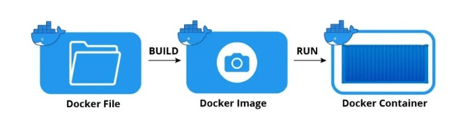

<details><summary> What is Docker? </summary>

* Docker is a tool for developing and deploying applications using containers. 
* A container is built on the concept that you may bundle your code together with its dependencies into one deployable unit.
* Once you have placed your product (code and dependencies) in the container, you may send it by boat or train (laptop or cloud), and when it gets to its destination, it continues to function (run) just as before the shipment was made.
  * Docker enables you to bundle your code and dependencies into containers that can subsequently be ported to various computers, even if the underlying hardware, operating system, and so on vary from the original machine(s).
* The use of Docker simplifies the process of deploying machine learning models. It’s a matter of whether or not you want to share your model with others. It’s as simple as wrapping your model in an API and putting it in a container utilizing Kubernetes technology.

</details>

-----

<details> <summary> What role does Docker play in the field of machine learning? </summary>

### Reproducibility in Docker
* It’s important to be able to reproduce your results as accurately as possible whether you’re developing models or doing data analysis. Consider the following scenario: you’ve been requested to do exploratory data analysis on a data collection. You create a local environment that includes the dataset and a few Python libraries, and then you launch your Jupyter notebook. After analyzing your dataset and developing a preliminary model, you decide to share your findings with your colleagues and friends. 

* The problem is that for your coworkers to replicate your analysis, they must replicate your whole stack as well. Docker allows you to quickly and easily replicate your working environment. It makes it possible to standardize the version of used libraries in a project, the random seeds, and even the operating system, so that the same results may be generated over and over again by a colleague working on a different machine.

### Portability in Docker
* As a Data Scientist, it is very beneficial to be able to move smoothly from working on your local workstation to external clusters that provide extra resources such as CPU, RAM, GPUs, etc. In addition, we want to be able to experiment with new frameworks and tools that are being created and shared by the community.

* Docker enables you to bundle your code and dependencies into containers that can subsequently be ported to various computers, even if the underlying hardware, operating system, and so on vary from the original machine(s). Another benefit of mobility is the ability to work on projects with a variety of different colleagues with relative simplicity. 

* As a data scientist, before you can begin working on an established codebase, you don’t have to spend an entire day (or week) setting up the environment. If the project has been “Dockerized”, you will be able to begin working on it immediately.

### Deployment in Dockers
* The use of Docker simplifies the process of deploying machine learning models. It’s a matter of whether or not you want to share your model with others. It’s as simple as wrapping your model in an API and putting it in a container utilizing Kubernetes technology.


</details>

-----

<details><summary> Building Docker images </summary>


### Docker
  


### What is a Docker file?
* A Dockerfile is a text document containing all the commands required to generate a specific image that is read by Docker to build that image automatically.

### What is an image?
* virtual machine snapshot is similar to a Docker image, but there are several differences. 
* A Docker image is a file used to execute code in a Docker container. 
* Docker images act as a set of instructions to build a Docker container, like a template. ...
* A Docker image contains application code, libraries, tools, dependencies and other files needed to make an application run.


### What is container?
* Running instance of docker images.
  
</details>

-----

<details><summary> Best practices for building images </summary>

* **Use official images**
  * It’s suggested that you use the Docker Official Images if you’re a new user of Docker.

-----

* **For the best results, use a solid base image**
  * When you build containers on top of an untrusted or unmaintained image, you’ll be inheriting all of that image’s flaws and vulnerabilities. So as a general rule of thumb, you should go by the following rules:
    * Trusted repositories and suppliers should be preferred over pictures created by unidentified individuals.
    * Check the image source and the Dockerfile before building your own base image when utilizing custom images. 
    * An image published in a public registry is not guaranteed to be produced from a Dockerfile. 
    * There is no guarantee that it will be updated in the future.

-----

* **.dockerignore**
  * To prevent undesirable files and directories from being contained in the image when we run the docker build command, we may create a .dockerignore file that contains the files and directories that we don’t want in the image.
  *  The application’s processing time could come down if this file isn’t included.

-----

* **Containers must be ephemeral**
  * Ephemeral containers should be generated by the image specified in your Dockerfile. 
  * It is referred to as an ephemeral container when it can be halted and destroyed before being rebuilt and replaced with a new container, requiring the least setup and configuration. 
  * Disposable containers such as ephemeral ones might be regarded as such. 
  * For each new container instance, there is no connection to the prior ones. 
  * You should use as many ephemeral patterns as feasible when creating Docker images.

-----

* **Avoid installing unnecessary applications**
  * With the promise of utilizing it later, it might be tempting to install more than you need but to decrease the image’s size and complexity, just install what is actually required. 
  * For example, it’s a good idea to remove the curl package once you’ve used it, since many times it’s just needed once during the building of a container.

-----

* **Spread each argument into several lines:** 
  * There are many advantages to sorting arguments in this manner. 
  * You can more easily determine whether there have been modifications, and it helps in the detection of duplication in the package.
  * refer below examples
  * eg 1
  > RUN apt-get update && apt-get install -y php5-cli php5 php5-gd php5-LDAP php5-mysql apache2 php5-pgsql libapache2-mod-php5

  * eg 2

  ```
    RUN apt-get update && \
        apt-get install -y \
          apache2 \
          libapache2-mod-php5 \
          php5 \
          php5-cli \
          php5-gd \
          php5-LDAP \
          php5-mysql \
          php5-pgsql
    
  ```

  * Lines that are not ordered are difficult to read. 
  * Due to the amount of mental effort and the focus required to comprehend them, we tend to skip over them during code reviews. So, eg 2 should be preferred.

-----

* **Take advantage of Docker caches**
  * A fascinating and helpful feature of Docker images is the Layer. 
  * Layers are used to build Docker images, and each layer has a specific purpose. 
  * Dockerfile instructions relate to each layer and describe the image’s file system changes between pre-execution and post-execution. 
  * Layers are cached by Docker in order to save build times. Rather than re-creating a similar layer, Docker will simply reuse an existing layer from the cache.
  * On the other side, adding layers that aren’t absolutely essential increases the amount of work. Many unneeded layers have performance concerns since Docker layers are filesystems. 
  * It is more efficient to establish a single cache with a single RUN command that applies all dependencies rather than to divide it into many levels since each run command produces a new layer.
  * By finding cacheable layers and using them, you will save a lot of time in the long run.

-----

* **Reduce the number of layers by condensing your assertions into one:**
  * Each instruction in the Dockerfile adds a layer to the image. 
  * The number of instructions and layers should be maintained to a minimum since this has an impact on performance and build times. 
  * So when performing a RUN, COPY, or ADD command attempt to execute this in a single sentence
  * eg 1
  ```  
   FROM alpine:3.4
   RUN apk update
   RUN apk add curl
   RUN apk add vim
   RUN apk add git
  ```
  * eg 2
  ```
  FROM alpine:3.4

  RUN apk update && \
        apk add curl && \
        apk add vim && \
        apk add git
  ```
</details>

-----

<details> <summary> Building containers </summary>

### What is a container?
  * Applications may be packaged in containers that are nothing but isolated environments. It is the goal of the containers to separate and enable the mobility of applications across multiple platforms.
  * In a container, an image offers all the required files to operate a set of processes. Via containers, applications are isolated from other processes that share the same kernel, so no one process can affect the work of others.
  * A cluster is a collection of containers. In a cluster, resources such as storage and processing power may be shared, making it feasible to operate dozens or even hundreds of containers concurrently.
  * Containers are very useful in the context of software development. The DevOps approach is based on their applicability, which assists both the Operations and Development departments. 
  * When it comes to developing applications, containers are agnostic to the environment’s features, such as the operating system, so they can be easily shared and accessed, and when it comes to running applications on the same kernel, they’re not as complex as virtual machines.
  * Despite their resemblance, a container is not a virtual machine because containers may share the same kernel as the operating system, but virtual machines can’t.

</details>

-----

<details> <summary> Best practices for building containers </summary>

* **One container for each process**
  * It is a typical error to perceive containers as virtual computers that can run several distinct aspects at the same time. 
  * A container may work in this fashion, but this diminishes most of the benefits of container architecture. 
  * For example, it’s tempting to run all three components of the standard Apache/MySQL/PHP stack simultaneously. However, the suggested approach is to utilize two or three distinct containers: one for Apache, one for MySQL, and maybe one for PHP if you are using PHP-FPM.
  * Since a container is meant to have the same lifetime as the app it contains, each container can only have one app.
  * When a container is launched, so is the app, and when the app is closed, so is the container
  * There are several reasons why it is advised to run only one process per container:
    * Let’s say that you have two web servers and a database in your application architecture. 
    * It is possible to run all three in one container, but it is preferable to run each service in a distinct container so that it is simpler to reuse and grow.
    * A separate container for each service allows you to grow one of your web servers horizontally to accommodate the extra traffic. 
    * You may need a containerized database in the future for another service. In such a case, the same database container may be reused without the need for two additional services. 
    * Logging becomes significantly more difficult when containers are coupled. 
    * With a smaller surface area to deal with, it’s considerably simpler to produce security updates or troubleshoot a problem.

* **Tag your containers**
  * When it comes to maintaining images, Docker tagging is an incredibly useful tool. It assists in maintaining several versions of a docker image. Below is an example of constructing a docker image with tag name v1.0.1
  * > docker build -t geekflare/ubuntu:v1.0.1
  * There are a couple of tags that you can use:
    * Use **stable tags** for retaining the basic image of the container. 
      * Avoid utilizing these tags for deployment containers since these tags will get changed often, and it might lead to discrepancies in the production environment.
    * Use unique tags for deployments. 
      * Using **unique tags**, you may extend your production cluster to numerous nodes with ease. 
      * It prevents inconsistencies, and hosts will not fetch any other docker image version.
  * It is a recommended practice to disable write-enable on the deployed image tags. This prevents the deployed image from being accidentally deleted from the registry.

* **Running your model in Docker**
  * Why put a machine learning model in Docker?
    * *Challenges*
      * The process of building a machine learning model that runs on our PC isn’t that difficult but working with a client who wants to utilize the model at scale in different sorts of servers can be really challenging. There are a variety of concerns that might occur, including performance issues, program crashes, and poor optimization.
      * Our machine learning model can be implemented in a single programming language like Python, but the application will need to communicate with other apps written in other programming languages for data intake, preprocessing, front-end, etc., which is a challenge on its own.
    
    * *Benefits of using Docker*
      * As each microservice may be in a separate language, docker enables scalability and the simple addition or removal of independent services. Replicability, portability, ease of deployment, incremental updates, lightweight, and simplicity are some of the benefits of Docker.
      * It is a data scientist’s greatest fear that their model will not accurately reflect the outcomes of real-life or when it is shared with other researchers. In certain cases, the model isn’t the issue; rather, it’s the need of reproducing the whole stack. Using Docker, it is possible to replicate the working environment that is needed to train and operate the machine learning model on any system. 
      * With Docker, code and dependencies can be packaged together into portable containers that can be run on a variety of different hosts, regardless of the hardware or operating system. 
      * A training model may be constructed on a local system and simply transferred to remote clusters that have more resources like GPUs, more RAM, or powerful CPUs. OpenShift, a Kubernetes distribution, makes it simple to deploy and makes your model accessible to the world by wrapping it into an API in a container and deploying the container using technologies like this. 
      * Container image versions can be tracked using Docker, as well as who developed them and with what. Versions may be rolled back as well. In addition, your machine learning application may function even if one of the services it relies on is upgrading, fixing, or unavailable. For example, if an output message contained in the whole solution has to be updated, there is no need to interact with other services and update the entire program.

    * *Tracking the metrics of your model*
      * Even after model development, the machine learning (ML) lifecycle is far from over; in fact, that is merely the beginning of the process. To put your model into production, the next step is to deploy and monitor your model. To get the most out of your machine learning model, you need to keep an eye on it for as long as you’re using it.
      * Consider ML model monitoring the same as frequent health checkups. An operational duty, model modeling helps you to make sure your model is working at its best


</details>

-----

<details> <summary> Model monitoring </summary>

* **The importance of model monitoring**
  * Monitoring your ML models for errors, crashes, and latency is part of the operational stage that follows model deployment in the machine learning life cycle. 
  * Model drift, or the degradation of models as they are used, is the most straightforward reason why model monitoring is necessary. There are several reasons why a model’s prediction ability might decline-
    * *Previously unseen information:* 
      * If there is not enough labeled data or there are computational restrictions on training, it’s impossible to avoid data samples where your machine learning model produces results that are either erroneous or wrong.
    * *Variable connections and changes in the surrounding environment:* 
      * ML models are optimized depending on the variables and parameters at the time they were built. Consider how effective a spam-detection algorithm developed twenty years ago is now. Twenty years ago, the internet didn’t even exist! This approach may not be able to keep up with the ever-changing nature of spam emails, therefore it is doubtful that it would be effective at all. Changes in the environment are exemplified by this instance.
    * *Changes in the upstream data:* 
      * This is a term used to describe modifications to the operational data pipeline. The data science team often does not have complete control over all of the systems from which input data originates. While the data is recorded in Celsius, a fully isolated software engineering team may alter the measurement of a variable to Fahrenheit. If one was attempting to determine the average temperature, for example, this may have serious repercussions. 

</details>

-----

<details> <summary> ML experiment tracking tools </summary>

* It is quite obvious that the staging environment for a machine learning model is never equivalent to the production environment and thus you must keep tabs on any ML model you put in production.

* There are a number of technologies out there that can help us in doing just that. 
For starters, we have well-known tools, such as 
  * MLFlow
  * TensorBoard 
  * Neptune
  * DVC
  * Amazon SageMaker, and so on.

</details>

-----

<!-- 
*comment* 

<details> <summary> </summary>
</details>

--/>